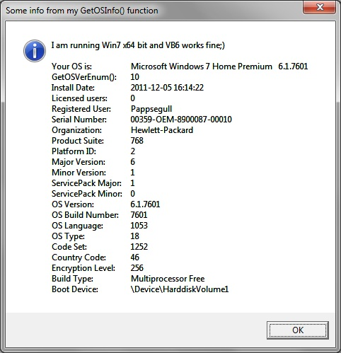



## Get OS Info

### Description

I did notice that GetVersionEx return Win XP when I run Win 7 64bit, but this functions return it correct on my PC
 
### More Info
 

             |
---                |---
**Submitted On**   |2011-12-22 09:40:02
**By**             |[Jan Andersson](https://github.com/Planet-Source-Code/PSCIndex/blob/master/ByAuthor/jan-andersson.md)
**Level**          |Beginner
**User Rating**    |5.0 (10 globes from 2 users)
**Compatibility**  |VB 6\.0
**Category**       |[Registry](https://github.com/Planet-Source-Code/PSCIndex/blob/master/ByCategory/registry__1-36.md)
**World**          |[Visual Basic](https://github.com/Planet-Source-Code/PSCIndex/blob/master/ByWorld/visual-basic.md)
**Archive File**   |[Get\_OS\_Inf22169212222011\.zip](https://github.com/Planet-Source-Code/jan-andersson-get-os-info__1-74224/archive/master.zip)

